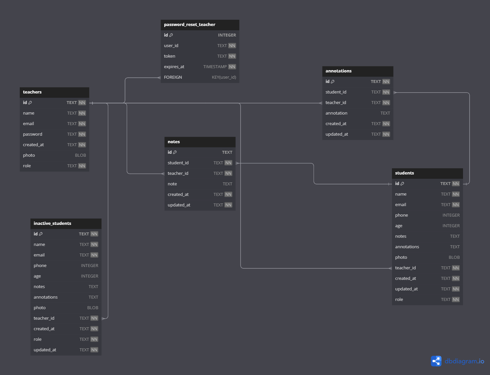

## Project ClassFlow

### Online Platform for Independent Teachers

We will develop an online platform to assist independent teachers in organizing specific information for each student. Key features include:

**Student Management:**

- Teachers can register, edit, and delete students, maintaining personalized notes for each one.

**Class Calendar:**

- A calendar will enable teachers to view and manage their occupied and available class hours across different periods (daily, monthly, yearly).

**Student-Teacher Communication:**

- Students receive an access link upon registration, allowing them to view attendance history, grades, and use a chat feature to interact with the teacher.

## Technologies Used

### Front-End:

- JavaScript, React, useEffect, useState, React Router, Custom Hooks, Context
- Styling: Tailwind CSS

### Back-End:

- Node, Axios, Express, TypeScript, SQLite, Knex

### Diagram

### Status: In development
