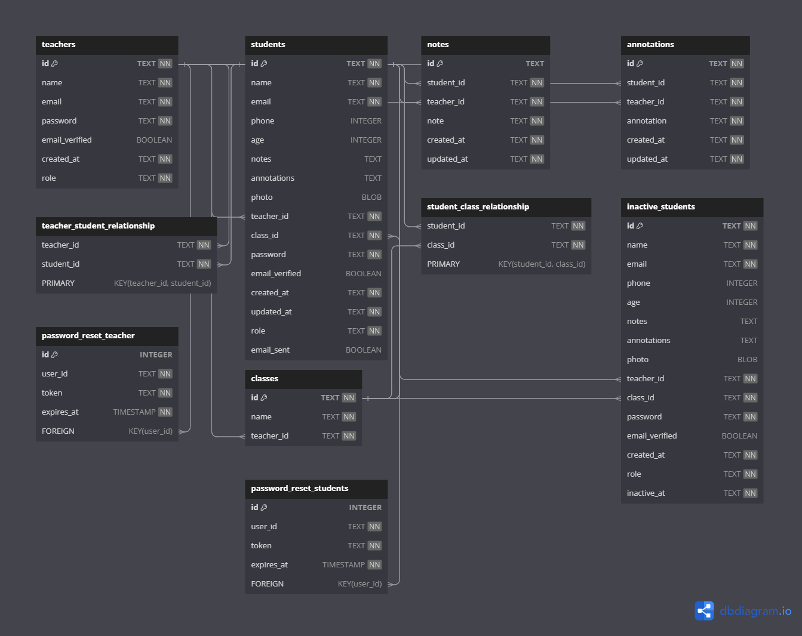

## Projeto ClassFlow

### Plataforma Online para Professores Independentes

## Índice:

- <a href="#Objetivo"> Objetivo </a>
- <a href="#Documentação da API"> Documentação da API </a>
- <a href="#Estruturação do banco de dados"> Estruturação do banco de dados </a>
  <a href="#Como rodar este projeto?"> Como rodar este projeto? </a>
- <a href="#Técnologias utilizadas"> Técnologias utilizadas </a>
- <a href="#Testes"> Testes </a>
- <a href="#Autoria"> Autoria </a>
- <a href="#Próximos Passos"> Próximos Passos </a>

## Objetivo

Irei desenvolver uma plataforma online para ajudar os professores independentes a organizar suas aulas diárias com informação específicas de cada aluno. As principais funcionalidades incluem:

**Gestão de alunos:**

- Os professores podem registar novo aluno, editar e apagar alunos, mover alunos da lista de "ativos" para a lista de "inativos", caso necessário, mantendo notas e anotações personalizadas para cada um.

## Documentação da API

[Link Documentação](https://documenter.getpostman.com/view/25825355/2sA2r3amFv)

Link Front-End Repositório (Em desenvolvimento)
Front-End Deploy link (Under development)

### Structuring the database

ClassFlow Back-End Diagram](./img/diagram.png)

## How to run this project?

```bash
#Clone this repository
$ git clone lin krepo

#Access the project folder in your terminal
$ cd folderName

# Install the dependencies
$ npm install

# Run the application
$ npm run dev

# The application will start on port 3003, access it through the browser: http://localhost:3003

# Use an API Client to make the requests

# Run all the unit tests
$ npm run test
```

## Technologies used

//### Front-End:

//- JavaScript, React, useEffect, useState, React Router, Custom Hooks, Context
//- Style: Tailwind CSS

### Back-End:

1. [Node.js](https://nodejs.org/en)
2. [TypeScript](https://www.typescriptlang.org/)
3. [ExpressJs](https://expressjs.com/)
4. [SQLite3 / SQL](https://sqlite.org/index.html)
5. [Knex](https://knexjs.org/)
6. [OOP](https://pt.wikipedia.org/wiki/Programa%C3%A7%C3%A3o_orientada_a_objetos)
7. [Layered Architecture](https://pt.wikipedia.org/wiki/Arquitetura_multicamada)
8. [UUID generation](https://pt.wikipedia.org/wiki/Identificador_%C3%BAnico_universal)
9. hash generation](https://pt.wikipedia.org/wiki/Fun%C3%A7%C3%A3o_hash_criptogr%C3%A1fica)
10. [Authentication and authorization](https://pt.wikipedia.org/wiki/Autoriza%C3%A7%C3%A3o)
11. [Routing](https://acervolima.com/roteamento-em-node-js/)
12. [Postman](https://www.postman.com/)

### Testing

All endpoints have been tested and approved using the Postman platform. Documentation link:

https://documenter.getpostman.com/view/25825355/2sA2r3amFv

Automated testing is also being carried out using Jest.
The main focus of automated testing in this project is the Business layer, as this is where all the platform's business rules are located.
Currently (Feb/2024): TeacherBusiness Automated Tests 100%

### Next steps

1 - **Class calendar:**

- A calendar allows teachers to view and manage the class hours occupied and available in different periods (daily, monthly, yearly).

2 - \*\*Communication between students and teachers

- Students receive an access link when they register, which allows them to view their attendance history, grades and use a chat feature to interact with the teacher.

3 - Automated testing

-Perform tests on the entire Business layer, including teachers, students and inactive students.

## Technologies used

//### Front-End:

//- JavaScript, React, useEffect, useState, React Router, Custom Hooks, Context
//- Style: Tailwind CSS

### Back-End:

- Node, Axios, Express, TypeScript, SQLite, Knex

### Diagram



## Project status

In process. ⏳

Michelle Antunes, maio/2023.
<br>

Linkedin: www.linkedin.com/in/michelle-antunes-868b24156
<br>
Email: miichelleantunes@outlook.com
